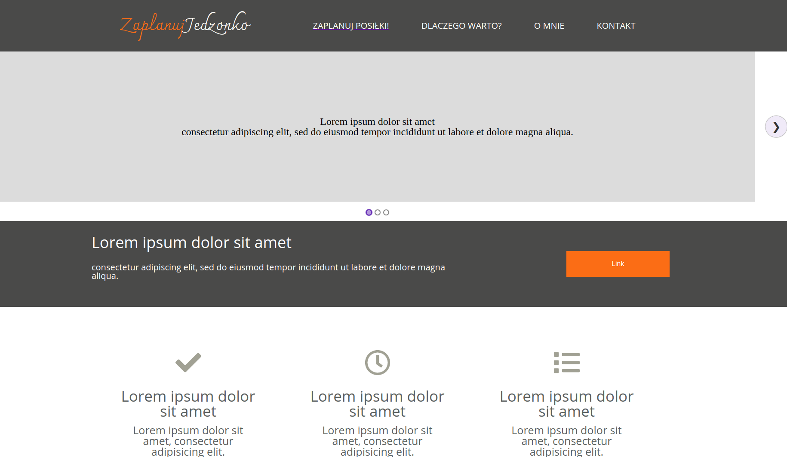
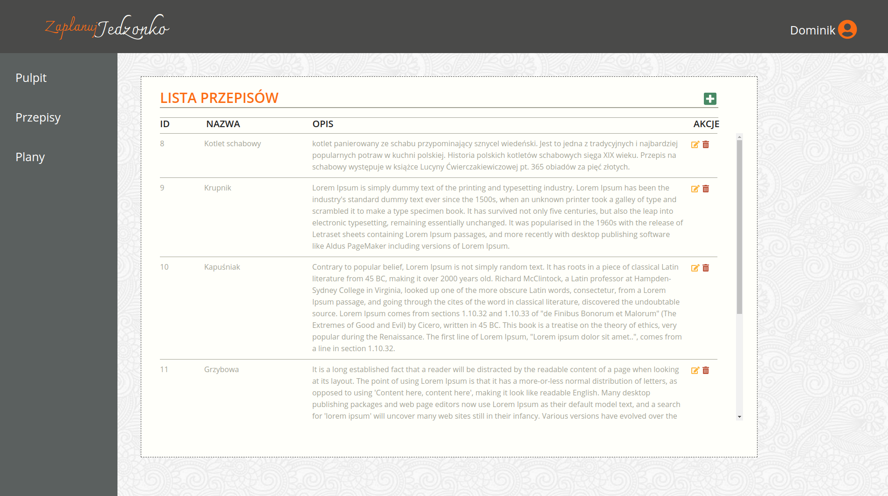

# Witaj w zaplanuj jedzonko! - Scrum Lab - Warsztat pracy w grupie. 
>**Opis**:
Przygotowanie do pracy w zespole programistycznym. Podczas projektu nauczyliśmy się:
>- podstawowej znajomości standardów zarządzania wytwarzaniem oprogramowania w zespołach projektowych – Scrum, Agile, tablica Kanban
>- umiejętności wykorzystania narzędzi w pracy zespołowej - Trello, GitHub
>- umiejętności pracy z Git’em, konfigurowanie środowiska projektowego, code review


## 🔆 Langing page


## 📖 Wygląd aplikacji


## 💁 Funkcje
* Wszystkie przepisy i plany zapisują się w JSON-server


# 💡 Technologie
- Create React App
- React
- React Router
- React Hooks
- Node Sass
- JSON-server
- Fetch
- Walidacja danych

## ⏬ Jak zainstalować:
1. ``` git clone https://github.com/Dominikdoms/scramlab.git ```
2. ```  cd my-app ```
3. ``` npm i ```
4. ``` json-server db.json --watch ```
5. Otwórz drugi terminal i wpisz: ``` npm start ```


